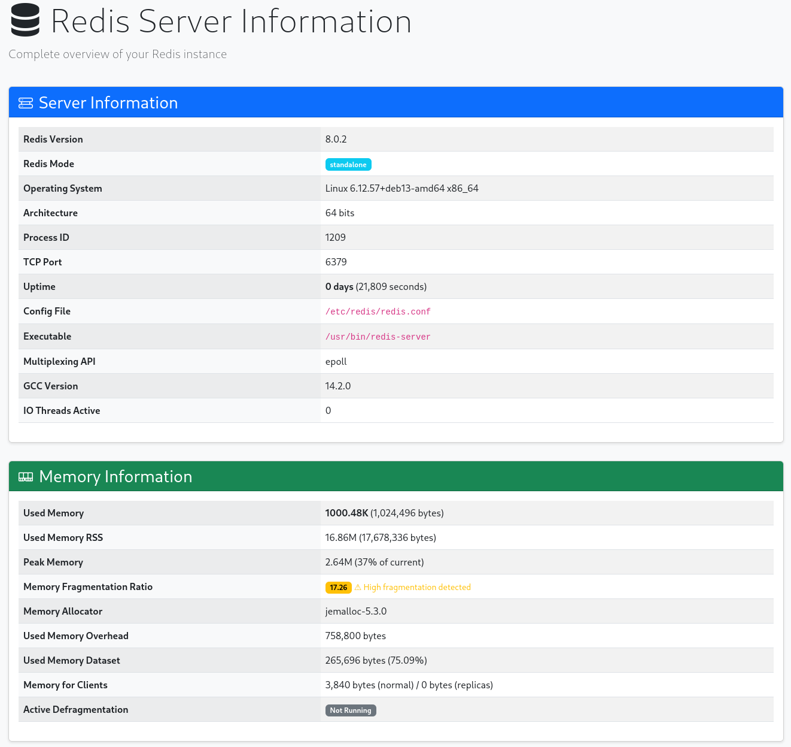

# Redis Information Analyzer

[](https://www.php.net/)
[](LICENSE)

A powerful PHP library to analyze and monitor Redis server performance and statistics. This library provides an elegant object-oriented interface to retrieve and analyze Redis information with strongly-typed DTOs.

## Features

- Comprehensive Redis server information retrieval
- Strongly-typed DTOs for all Redis INFO sections
- Detailed connected clients list with full metadata
- Memory usage and fragmentation analysis
- Performance statistics and hit rate monitoring
- Replication status tracking
- Persistence (RDB/AOF) monitoring
- CPU usage metrics
- Built-in web dashboard for visualization
- Singleton connection management
- Full PHP 8.2+ type safety

## Requirements

- PHP >= 8.2
- Redis server
- PHP Redis extension (`ext-redis`)
- Predis library

## Installation

Install the library via Composer:

```bash
composer require snipershady/redis-information-analyzer
```

## Quick Start

### Basic Usage

```php
<?php

require_once __DIR__ . '/vendor/autoload.php';

use RedisAnalizer\Service\RedisInformationRetriever;

// Create retriever instance
$retriever = new RedisInformationRetriever();

// Get all Redis information at once
$allInfo = $retriever->getAllInfo();

// Access specific sections
echo "Redis Version: " . $allInfo['server']->getRedisVersion() . "\n";
echo "Used Memory: " . $allInfo['memory']->getUsedMemoryHuman() . "\n";
echo "Connected Clients: " . $allInfo['clients']->getConnectedClients() . "\n";
```

### Retrieving Specific Information

#### Server Information

```php
$serverInfo = $retriever->getServerInfo();

echo "Redis Version: " . $serverInfo->getRedisVersion() . "\n";
echo "Redis Mode: " . $serverInfo->getRedisMode() . "\n";
echo "OS: " . $serverInfo->getOs() . "\n";
echo "Uptime: " . $serverInfo->getUptimeInDays() . " days\n";
echo "TCP Port: " . $serverInfo->getTcpPort() . "\n";
```

#### Memory Information

```php
$memoryInfo = $retriever->getMemoryInfo();

echo "Used Memory: " . $memoryInfo->getUsedMemoryHuman() . "\n";
echo "Peak Memory: " . $memoryInfo->getUsedMemoryPeakHuman() . "\n";
echo "Fragmentation Ratio: " . $memoryInfo->getMemFragmentationRatio() . "\n";

if ($memoryInfo->isFragmented()) {
    echo "Warning: High memory fragmentation detected!\n";
}
```

#### Statistics

```php
$statsInfo = $retriever->getStatsInfo();

echo "Total Commands: " . number_format($statsInfo->getTotalCommandsProcessed()) . "\n";
echo "Ops/Second: " . $statsInfo->getInstantaneousOpsPerSec() . "\n";
echo "Hit Rate: " . $statsInfo->getHitRate() . "%\n";
echo "Keyspace Hits: " . number_format($statsInfo->getKeyspaceHits()) . "\n";
echo "Keyspace Misses: " . number_format($statsInfo->getKeyspaceMisses()) . "\n";
```

#### Connected Clients

```php
// Get connected clients count
$numberOfClients = $retriever->getNumberOfConnection();
echo "Connected clients: {$numberOfClients}\n";

// Get detailed client list
$clientList = $retriever->getClientList();

foreach ($clientList as $client) {
    echo "Client #{$client->getId()}\n";
    echo "  Address: {$client->getAddr()}\n";
    echo "  Name: " . ($client->getName() ?? 'unnamed') . "\n";
    echo "  Age: {$client->getAge()}s\n";
    echo "  Idle: {$client->getIdle()}s\n";
    echo "  Database: {$client->getDb()}\n";
    echo "  Last Command: " . ($client->getCmd() ?? 'N/A') . "\n";
    echo "  Memory: {$client->getTotalMemoryKB()} KB\n";
    echo "\n";
}
```

#### Clients Summary Information

```php
$clientsInfo = $retriever->getClientsInfo();

echo "Connected Clients: " . $clientsInfo->getConnectedClients() . "\n";
echo "Max Clients: " . $clientsInfo->getMaxclients() . "\n";
echo "Blocked Clients: " . $clientsInfo->getBlockedClients() . "\n";
echo "Client Usage: " . $clientsInfo->getClientUsagePercentage() . "%\n";
```

#### CPU Information

```php
$cpuInfo = $retriever->getCpuInfo();

echo "System CPU: " . $cpuInfo->getUsedCpuSys() . "s\n";
echo "User CPU: " . $cpuInfo->getUsedCpuUser() . "s\n";
echo "Total CPU: " . $cpuInfo->getTotalCpuUsed() . "s\n";
```

#### Keyspace Information

```php
$keyspaceInfo = $retriever->getKeyspaceInfo();

echo "Total Databases: " . $keyspaceInfo->getDatabaseCount() . "\n";
echo "Total Keys: " . number_format($keyspaceInfo->getTotalKeys()) . "\n";
echo "Total Expires: " . number_format($keyspaceInfo->getTotalExpires()) . "\n";

foreach ($keyspaceInfo->getDatabases() as $dbNumber => $dbInfo) {
    echo "\nDatabase {$dbNumber}:\n";
    echo "  Keys: {$dbInfo['keys']}\n";
    echo "  Expires: {$dbInfo['expires']}\n";
    echo "  Avg TTL: {$dbInfo['avg_ttl']} ms\n";
}
```

#### Replication Information

```php
$replicationInfo = $retriever->getReplicationInfo();

echo "Role: " . $replicationInfo->getRole() . "\n";

if ($replicationInfo->isMaster()) {
    echo "Connected Slaves: " . $replicationInfo->getConnectedSlaves() . "\n";
    echo "Replication Offset: " . $replicationInfo->getMasterReplOffset() . "\n";
} else {
    echo "Master Host: " . $replicationInfo->getMasterHost() . "\n";
    echo "Master Port: " . $replicationInfo->getMasterPort() . "\n";
    echo "Link Status: " . $replicationInfo->getMasterLinkStatus() . "\n";
    echo "Connected: " . ($replicationInfo->isReplicaConnected() ? 'Yes' : 'No') . "\n";
}
```

#### Persistence Information

```php
$persistenceInfo = $retriever->getPersistenceInfo();

// RDB (Snapshot) information
echo "RDB Last Save: " . $persistenceInfo->getRdbLastSaveTimeFormatted() . "\n";
echo "Changes Since Last Save: " . $persistenceInfo->getRdbChangesSinceLastSave() . "\n";
echo "Last Save Status: " . $persistenceInfo->getRdbLastBgsaveStatus() . "\n";
echo "RDB Save in Progress: " . ($persistenceInfo->isRdbSaveInProgress() ? 'Yes' : 'No') . "\n";

// AOF information
if ($persistenceInfo->isAofEnabled()) {
    echo "\nAOF Enabled: Yes\n";
    echo "AOF Current Size: " . number_format($persistenceInfo->getAofCurrentSize()) . " bytes\n";
    echo "AOF Rewrite in Progress: " . ($persistenceInfo->isAofRewriteInProgress() ? 'Yes' : 'No') . "\n";
} else {
    echo "\nAOF Enabled: No\n";
}
```

### Monitoring Example

```php
<?php

require_once __DIR__ . '/vendor/autoload.php';

use RedisAnalizer\Service\RedisInformationRetriever;

$retriever = new RedisInformationRetriever();
$allInfo = $retriever->getAllInfo();

// Check memory fragmentation
if ($allInfo['memory']->isFragmented()) {
    echo "[WARNING] High memory fragmentation detected: " .
         $allInfo['memory']->getMemFragmentationRatio() . "\n";
}

// Check hit rate
$hitRate = $allInfo['stats']->getHitRate();
if ($hitRate < 80) {
    echo "[WARNING] Low hit rate: {$hitRate}%\n";
    echo "Consider reviewing your caching strategy.\n";
}

// Check client usage
$clientUsage = $allInfo['clients']->getClientUsagePercentage();
if ($clientUsage > 80) {
    echo "[WARNING] High client usage: {$clientUsage}%\n";
    echo "Current: {$allInfo['clients']->getConnectedClients()} / " .
         "{$allInfo['clients']->getMaxclients()}\n";
}

// Check persistence status
if ($allInfo['persistence']->getRdbLastBgsaveStatus() !== 'ok') {
    echo "[ERROR] Last RDB save failed!\n";
}
```

## Web Dashboard

The library includes a ready-to-use web dashboard for visualizing Redis information.



### Setup Web Dashboard

1. Point your web server to the `public` directory:

```bash
cd public
php -S localhost:8080
```

2. Open your browser and navigate to `http://localhost:8080`

The dashboard displays:
- Server information
- Memory usage and fragmentation
- Statistics and performance metrics
- CPU usage
- Connected clients summary
- Detailed client list with all metadata
- Keyspace information
- Replication status
- Persistence (RDB/AOF) status

### Custom Implementation

You can also integrate the library into your own application:

```php
<?php

require_once __DIR__ . '/../vendor/autoload.php';

$retriever = new RedisAnalizer\Service\RedisInformationRetriever();
$allInfo = $retriever->getAllInfo();
$clientList = $retriever->getClientList();

// Use the data in your application
// $allInfo contains all Redis information
// $clientList contains detailed client information
```

## Configuration

### Custom Redis Connection

By default, the library connects to `redis-server:6379`. To customize the connection, modify the `RedisConnection` class or extend it:

```php
<?php

namespace RedisAnalizer\Service;

use Predis\Client;

class RedisConnection
{
    private static ?RedisConnection $redisConnection = null;

    private function __construct(
        string $server = 'localhost',  // Change default host
        int $port = 6379,              // Change default port
        string $connectionIdentifier = 'redis-analyzer-predis01',
        bool $isPersistent = true
    ) {
        // Connection configuration
    }
}
```

## API Reference

### RedisInformationRetriever

Main class for retrieving Redis information.

#### Methods

- `getAllInfo(): array` - Get all Redis information sections
- `getServerInfo(): ServerDto` - Get server information
- `getMemoryInfo(): MemoryDto` - Get memory information
- `getStatsInfo(): StatsDto` - Get statistics
- `getCpuInfo(): CpuDto` - Get CPU information
- `getClientsInfo(): ClientsDto` - Get clients summary
- `getKeyspaceInfo(): KeyspaceDto` - Get keyspace information
- `getReplicationInfo(): ReplicationDto` - Get replication information
- `getPersistenceInfo(): PersistenceDto` - Get persistence information
- `getClientList(): array` - Get detailed list of connected clients
- `getNumberOfConnection(): int` - Get number of connected clients

### Available DTOs

Each DTO provides typed getter methods for accessing Redis information:

- `ServerDto` - Server and system information
- `MemoryDto` - Memory usage and fragmentation
- `StatsDto` - Performance statistics
- `CpuDto` - CPU usage metrics
- `ClientsDto` - Clients summary information
- `KeyspaceDto` - Database and keys information
- `ReplicationDto` - Replication status
- `PersistenceDto` - RDB and AOF persistence status
- `RedisClientInfo` - Individual client detailed information

## Development

### Code Quality Tools

```bash
# Run all quality checks
composer quality-check

# Fix code style
composer cs-fix

# Run static analysis
composer phpstan

# Run Rector
composer rector
```

### Requirements for Development

- PHP >= 8.2
- Composer
- PHP-CS-Fixer
- PHPStan
- Rector

## License

This project is licensed under the **GPL-3.0-or-later** License - see the [LICENSE](LICENSE) file for details.

## Author

**Stefano Perrini** (aka La Matrigna)
- Email: perrini.stefano@gmail.com
- Homepage: [https://www.spinfo.it](https://www.spinfo.it)

## Contributing

Contributions are welcome! Please feel free to submit a Pull Request.

## Support

For bugs, feature requests, or questions, please open an issue on the GitHub repository.
